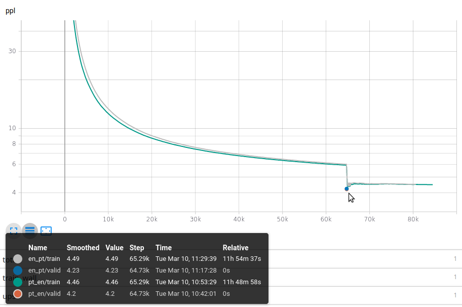

# datasets
* [movie-subtitles](http://opus.nlpl.eu/OpenSubtitles-v2018.php)
* [europal](https://www.statmt.org/europarl/)

# [fairseq-mt](https://github.com/pytorch/fairseq/tree/master/examples/translation)
[also see](https://modelzoo.co/model/fairseq-py)

    
    # Download and prepare the data
    cd examples/translation/
    bash prepare-wmt14en2de.sh
    cd ../..

    fairseq-train \
    data-bin/wmt17_en_de \
    --arch fconv_wmt_en_de \
    -s en -t de \
    --tensorboard-logdir tensorboard_logdir/wmt_en_de \
    --lr 0.5 --clip-norm 0.1 --dropout 0.2 --max-tokens 4000 \
    --criterion label_smoothed_cross_entropy --label-smoothing 0.1 \
    --lr-scheduler fixed --force-anneal 50 \
    --save-dir checkpoints/fconv_wmt_en_de
    
    fairseq-generate data-bin/wmt17_en_de \
    --path checkpoints/fconv_wmt_en_de/checkpoint_best.pt \
    --beam 5 --remove-bpe
    
    2020-03-09 23:29:55 | INFO | fairseq_cli.generate | Generate test with beam=5: BLEU4 = 18.06, 50.4/23.4/12.6/7.1 (BP=1.000, ratio=1.031, syslen=66478, reflen=64506)

### spanish-english

    TEXT=examples/translation/es_en
    fairseq-preprocess \
    --source-lang en --target-lang es \
    --trainpref $TEXT/train --validpref $TEXT/valid  \
    --destdir data-bin/en_es --thresholdtgt 0 --thresholdsrc 0 \
    --workers 20

es-en training

    fairseq-train \
    data-bin/en_es \
    --arch fconv_wmt_en_de \
    -s en -t es \
    --tensorboard-logdir $HOME/data/tensorboard_logdir/en_es \
    --lr 0.5 --clip-norm 0.1 --dropout 0.2 --max-tokens 4000 \
    --criterion label_smoothed_cross_entropy --label-smoothing 0.1 \
    --lr-scheduler fixed --force-anneal 50 \
    --save-dir checkpoints/en_es

es-en training transformer
    
    fairseq-train \
        data-bin/en_es \
        --arch transformer_vaswani_wmt_en_de_big --share-all-embeddings \
        --optimizer adam --adam-betas '(0.9, 0.98)' --clip-norm 0.0 \
        -s en -t es \
        --tensorboard-logdir $HOME/data/tensorboard_logdir/en_es_transformer \
        --lr 0.0005 --lr-scheduler inverse_sqrt --warmup-updates 4000 --warmup-init-lr 1e-07 \
        --dropout 0.3 --weight-decay 0.0 \
        --criterion label_smoothed_cross_entropy --label-smoothing 0.1 \
        --max-tokens 3584 \
        --fp16 \
        --save-dir checkpoints/en_es_transformer

    fairseq-train \
        data-bin/en_es \
        --arch transformer_vaswani_wmt_en_de_big \
        --optimizer adam --adam-betas '(0.9, 0.98)' --clip-norm 0.0 \
        -s en -t es \
        --tensorboard-logdir $HOME/data/tensorboard_logdir/en_es_transformer \
        --lr 0.0005 --lr-scheduler inverse_sqrt --warmup-updates 4000 --warmup-init-lr 1e-07 \
        --dropout 0.3 --weight-decay 0.0 \
        --criterion label_smoothed_cross_entropy --label-smoothing 0.1 \
        --max-tokens 3584 \
        --fp16 \
        --save-dir checkpoints/en_es_transformer

### portuguese
    
    bash prepare-ptbr2en.sh

    TEXT=examples/translation/pt_en
    fairseq-preprocess \
    --source-lang pt --target-lang en \
    --trainpref $TEXT/train --validpref $TEXT/valid  \
    --destdir data-bin/pt_en --thresholdtgt 0 --thresholdsrc 0 \
    --workers 20

pt-en training

    fairseq-train \
    data-bin/pt_en \
    --arch fconv_wmt_en_de \
    -s pt -t en \
    --tensorboard-logdir tensorboard_logdir/pt_en \
    --lr 0.5 --clip-norm 0.1 --dropout 0.2 --max-tokens 4000 \
    --criterion label_smoothed_cross_entropy --label-smoothing 0.1 \
    --lr-scheduler fixed --force-anneal 50 \
    --save-dir checkpoints/pt_en

en-pt training

    fairseq-train \
    data-bin/pt_en \
    --arch fconv_wmt_en_de \
    -s en -t pt \
    --tensorboard-logdir tensorboard_logdir/en_pt \
    --lr 0.5 --clip-norm 0.1 --dropout 0.2 --max-tokens 4000 \
    --criterion label_smoothed_cross_entropy --label-smoothing 0.1 \
    --lr-scheduler fixed --force-anneal 50 \
    --save-dir checkpoints/en_pt
#### results

### deployment
    rsync -avz -e "ssh -o StrictHostKeyChecking=no -o UserKnownHostsFile=/dev/null" --progress /home/tilo/data/models/MT gunther@gunther:/home/gunther/tilo_data/

used standard ml-container
pip install fairseq==0.9.0

### convolutional
Namespace(all_gather_list_size=16384, arch='fconv_wmt_en_de', best_checkpoint_metric='loss', bpe=None, broadcast_buffers=False, bucket_cap_mb=25, clip_norm=0
.1, cpu=False, criterion='label_smoothed_cross_entropy', curriculum=0, data='data-bin/en_es', dataset_impl=None, ddp_backend='c10d', decoder_attention='True', decoder_embed_dim=768, decoder_embed_path=None, deco
der_layers='[(512, 3)] * 9 + [(1024, 3)] * 4 + [(2048, 1)] * 2', decoder_out_embed_dim=512, device_id=0, disable_validation=False, distributed_backend='nccl', distributed_init_method='tcp://localhost:16874', dis
tributed_no_spawn=False, distributed_port=-1, distributed_rank=0, distributed_world_size=2, dropout=0.2, empty_cache_freq=0, encoder_embed_dim=768, encoder_embed_path=None, encoder_layers='[(512, 3)] * 9 + [(102
4, 3)] * 4 + [(2048, 1)] * 2', eval_bleu=False, eval_bleu_args=None, eval_bleu_detok='space', eval_bleu_detok_args=None, eval_bleu_print_samples=False, eval_bleu_remove_bpe=None, eval_tokenized_bleu=False, fast_
stat_sync=False, find_unused_parameters=False, fix_batches_to_gpus=False, fixed_validation_seed=None, force_anneal=50, fp16=False, fp16_init_scale=128, fp16_no_flatten_grads=False, fp16_scale_tolerance=0.0, fp16
_scale_window=None, keep_best_checkpoints=-1, keep_interval_updates=-1, keep_last_epochs=-1, label_smoothing=0.1, left_pad_source='True', left_pad_target='False', load_alignments=False, log_format='tqdm', log_in
terval=1000, lr=[0.5], lr_scheduler='fixed', lr_shrink=0.1, max_epoch=0, max_sentences=None, max_sentences_valid=None, max_source_positions=1024, max_target_positions=1024, max_tokens=4000, max_tokens_valid=4000
, max_update=0, maximize_best_checkpoint_metric=False, memory_efficient_fp16=False, min_loss_scale=0.0001, min_lr=-1, momentum=0.99, no_epoch_checkpoints=False, no_last_checkpoints=False, no_progress_bar=False, 
no_save=False, no_save_optimizer_state=False, num_workers=1, optimizer='nag', optimizer_overrides='{}', patience=-1, required_batch_size_multiple=8, reset_dataloader=False, reset_lr_scheduler=False, reset_meters
=False, reset_optimizer=False, restore_file='checkpoint_last.pt', save_dir='checkpoints/en_es', save_interval=1, save_interval_updates=0, seed=1, sentence_avg=False, share_input_output_embed=False, skip_invalid_
size_inputs_valid_test=False, source_lang='en', target_lang='es', task='translation', tensorboard_logdir='/home/users/t/tilo-himmelsbach/data/tensorboard_logdir/en_es', threshold_loss_scale=None, tokenizer=None,
 train_subset='train', truncate_source=False, update_freq=[1], upsample_primary=1, use_bmuf=False, user_dir=None, valid_subset='valid', validate_interval=1, warmup_updates=0, weight_decay=0.0)
### transformer
Namespace(activation_dropout=0.0, activation_fn='relu', adam_betas='(0.9, 0.98)', adam_eps=1e-08, adaptive_input=False, adaptive_softmax_cutoff=None, adaptive_sof
tmax_dropout=0, all_gather_list_size=16384, arch='transformer_vaswani_wmt_en_de_big', attention_dropout=0.0, best_checkpoint_metric='loss', bpe=None, broadcast_buffers=False, bucket_cap_mb=25, clip_norm=0.0, cpu
=False, criterion='label_smoothed_cross_entropy', cross_self_attention=False, curriculum=0, data='data-bin/en_es', dataset_impl=None, ddp_backend='c10d', decoder_attention_heads=16, decoder_embed_dim=1024, decod
er_embed_path=None, decoder_ffn_embed_dim=4096, decoder_input_dim=1024, decoder_layerdrop=0, decoder_layers=6, decoder_layers_to_keep=None, decoder_learned_pos=False, decoder_normalize_before=False, decoder_outp
ut_dim=1024, device_id=0, disable_validation=False, distributed_backend='nccl', distributed_init_method='tcp://localhost:19139', distributed_no_spawn=False, distributed_port=-1, distributed_rank=0, distributed_w
orld_size=2, dropout=0.3, empty_cache_freq=0, encoder_attention_heads=16, encoder_embed_dim=1024, encoder_embed_path=None, encoder_ffn_embed_dim=4096, encoder_layerdrop=0, encoder_layers=6, encoder_layers_to_kee
p=None, encoder_learned_pos=False, encoder_normalize_before=False, eval_bleu=False, eval_bleu_args=None, eval_bleu_detok='space', eval_bleu_detok_args=None, eval_bleu_print_samples=False, eval_bleu_remove_bpe=No
ne, eval_tokenized_bleu=False, fast_stat_sync=False, find_unused_parameters=False, fix_batches_to_gpus=False, fixed_validation_seed=None, fp16=True, fp16_init_scale=128, fp16_no_flatten_grads=False, fp16_scale_t
olerance=0.0, fp16_scale_window=None, keep_best_checkpoints=-1, keep_interval_updates=-1, keep_last_epochs=-1, label_smoothing=0.1, layer_wise_attention=False, layernorm_embedding=False, left_pad_source='True', 
left_pad_target='False', load_alignments=False, log_format='tqdm', log_interval=1000, lr=[0.0005], lr_scheduler='inverse_sqrt', max_epoch=0, max_sentences=None, max_sentences_valid=None, max_source_positions=102
4, max_target_positions=1024, max_tokens=3584, max_tokens_valid=3584, max_update=0, maximize_best_checkpoint_metric=False, memory_efficient_fp16=False, min_loss_scale=0.0001, min_lr=-1, no_cross_attention=False,
 no_epoch_checkpoints=False, no_last_checkpoints=False, no_progress_bar=False, no_save=False, no_save_optimizer_state=False, no_scale_embedding=False, no_token_positional_embeddings=False, num_workers=1, optimiz
er='adam', optimizer_overrides='{}', patience=-1, required_batch_size_multiple=8, reset_dataloader=False, reset_lr_scheduler=False, reset_meters=False, reset_optimizer=False, restore_file='checkpoint_last.pt', s
ave_dir='checkpoints/en_es_transformer', save_interval=1, save_interval_updates=0, seed=1, sentence_avg=False, share_all_embeddings=False, share_decoder_input_output_embed=False, skip_invalid_size_inputs_valid_t
est=False, source_lang='en', target_lang='es', task='translation', tensorboard_logdir='/home/users/t/tilo-himmelsbach/data/tensorboard_logdir/en_es_transformer', threshold_loss_scale=None, tokenizer=None, train_
subset='train', truncate_source=False, update_freq=[1], upsample_primary=1, use_bmuf=False, use_old_adam=False, user_dir=None, valid_subset='valid', validate_interval=1, warmup_init_lr=1e-07, warmup_updates=4000
, weight_decay=0.0)
